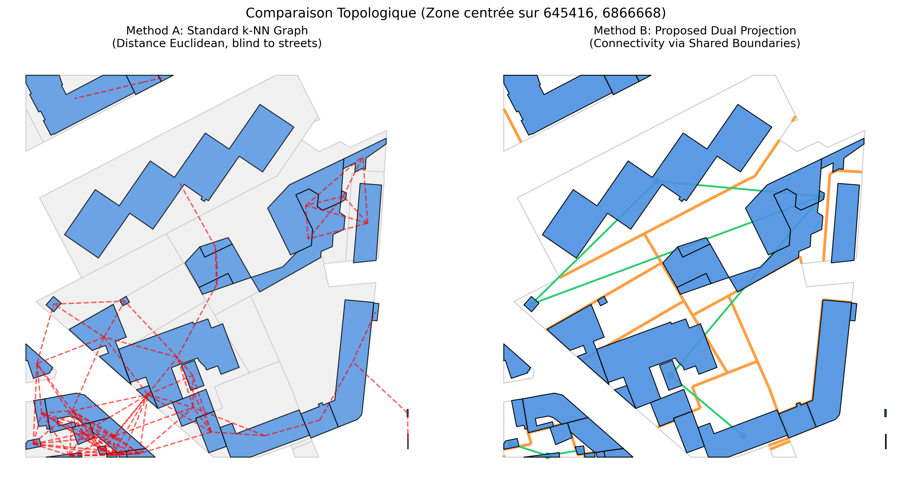
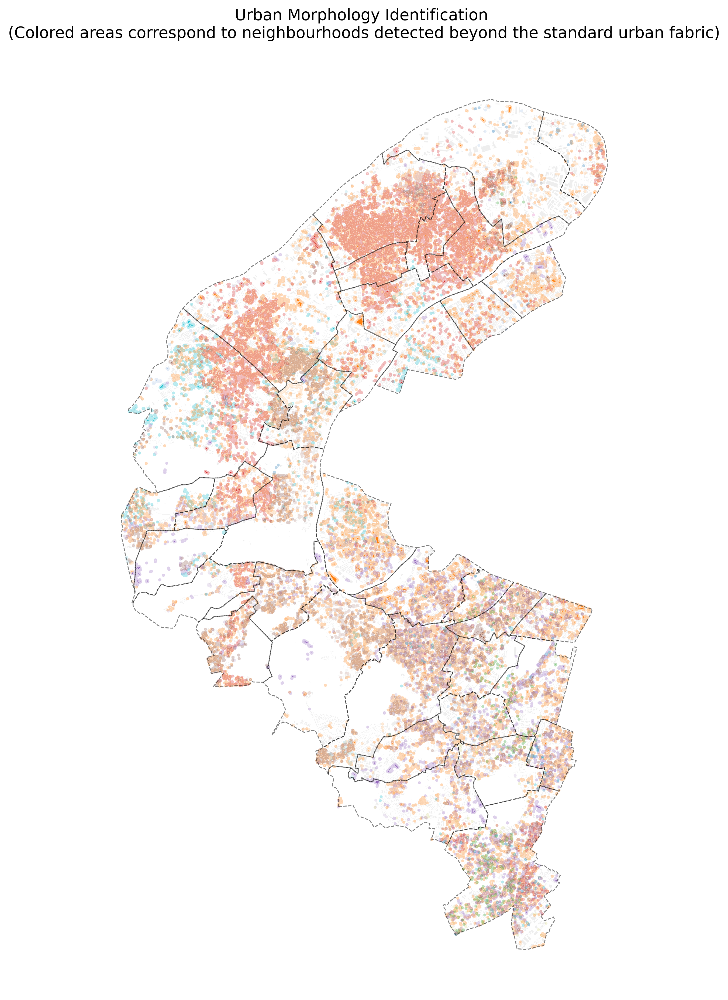

# Topological Building Clustering via Differentiable Tripartite Modularity

**Working Paper BH-2025-02 | Insee**

This repository contains the implementation of a **Topological End-to-End Clustering** method for urban structures. It extends Deep Modularity Networks (DMoN) to heterogeneous tripartite graphs (Addresses-Buildings-Parcels).

Unlike standard approaches based on Euclidean distance ($k$-NN) which ignore physical obstacles, this method uses a **Dual Topological Projection** derived from cadastral data to define building connectivity. This ensures that the detected communities respect urban blocks and street networks.


*Fig 1. Comparison: Standard k-NN (left) crosses streets, while our Dual Projection (right) respects the urban fabric.*

## 🚀 Key Features

* **Physically Constrained Graph:** Graph construction based on **Weighted Cadastral Topology** (PolygonGNN approach), preventing edges from crossing public spaces.
* **Tripartite DMoN:** A differentiable modularity loss function optimized for $X \to Y \to Z$ co-paths.
* **Anti-Hub Correction:** An intrinsic regularization term to handle the extreme density heterogeneity of urban graphs (e.g., vertical condominiums vs. individual housing).
* **Scalable:** Implemented using sparse matrix operations (`torch-sparse`), capable of processing regional datasets (>300k nodes) on a standard GPU.

## 🛠️ Installation

This project uses [uv](https://github.com/astral-sh/uv) for dependency management.

### Prerequisites
* Python 3.10+
* CUDA-compatible GPU (recommended)

### Setup
1.  Clone the repository:
    ```bash
    git clone [https://github.com/username/topological-urban-clustering.git](https://github.com/username/topological-urban-clustering.git)
    cd topological-urban-clustering
    ```

2.  Install dependencies.
    *Note: PyTorch Geometric dependencies (scatter, sparse, cluster) require specific wheels.*
    ```bash
    # Install standard dependencies
    uv sync

    # Install PyG binaries (Example for PyTorch 2.5.1 + CUDA 12.4)
    # Adjust the URL according to your setup: [https://data.pyg.org/whl/](https://data.pyg.org/whl/)
    uv pip install torch-scatter torch-sparse torch-cluster \
      --find-links [https://data.pyg.org/whl/torch-2.5.1+cu124.html](https://data.pyg.org/whl/torch-2.5.1+cu124.html)
    ```

## 📂 Data

The model expects the following input files in the `data/` directory:
* **BD TOPO (IGN):** Building geometries (`.gpkg`).
* **Cadastre (Etalab):** Parcel geometries (`.json` or `.gpkg`).
* **BAN:** National Address Base (`.csv`).
* **RNB:** National Building Repository (for interoperability).

## 🏃 Usage

### 1. Hyperparameter Search (Optional)
Run a Bayesian search (Optuna) to calibrate the collapse penalty and learning rate.
```bash
uv run python optuna_runV2.py --device cuda --trials 30 --epochs 100
````

### 2\. Training (Golden Run)

Train the model with the optimized parameters.

```bash
uv run python main.py \
  --device cuda \
  --epochs 150 \
  --lr 0.0044 \
  --lambda_collapse 0.068 \
  --beta 2.0 \
  --out_csv out/final_results.csv
```

## 📊 Results

The model identifies distinct urban morphotypes (dense centers, large housing estates, business districts) that naturally extend beyond administrative boundaries.

*Fig 2. Detected urban communities in Hauts-de-Seine (D092). Background gray represents standard residential fabric; colors indicate specific morphological structures.*

## 📚 Citation

If you use this code or method, please cite the associated working paper:

```bibtex
@techreport{hurpeau2025topological,
  title={Topological Building Clustering via Differentiable Tripartite Modularity},
  author={Hurpeau, Benoît},
  institution={Insee},
  type={Working Paper},
  number={BH-2025-02},
  year={2025}
}
```

## 📄 License

[MIT License](https://www.google.com/search?q=LICENSE)

```
